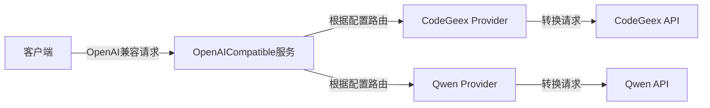

# OpenAICompatible

一个提供多种大语言模型服务提供商接口的中间件，支持动态切换服务提供商，提供OpenAI兼容的API接口。

## 特性

- 🔄 支持多种服务提供商（CodeGeex、Qwen等）
- 🎯 提供OpenAI兼容的API接口
- 🔌 易于扩展新的服务提供商
- 🛠️ 支持跨平台（Windows、Linux、MacOS）
- 🚀 简单易用的配置

## 架构



## 安装

### 预编译二进制

从[releases](https://github.com/WenChunTech/OpenAICompatible/releases)页面下载适合你系统的预编译二进制文件。

### 从源码构建

需求：
- Go 1.24.2 或更高版本

```bash
# 克隆仓库
git clone https://github.com/WenChunTech/OpenAICompatible.git
cd OpenAICompatible

# 构建
./build.sh
```

## 配置

创建`config.json`配置文件：

```json
{
    "host": "0.0.0.0",
    "port": 8080,
    "codegeex": {
        "token": "你的CodeGeex token"
    },
    "qwen": {
        "token": "你的Qwen token"
    }
}
```

### 配置项说明

- `host`: 服务监听地址
- `port`: 服务监听端口
- `codegeex`: CodeGeex服务配置
  - `token`: 访问令牌
- `qwen`: Qwen服务配置
  - `token`: 访问令牌

## API使用示例

### 聊天补全API

```bash
curl -X POST http://localhost:8080/v1/chat/completions \
  -H "Content-Type: application/json" \
  -d '{
    "model": "gpt-3.5-turbo",
    "messages": [
      {
        "role": "user",
        "content": "你好"
      }
    ]
  }'
```

### 获取模型列表API

```bash
curl http://localhost:8080/v1/models
```

## 扩展新的服务提供商

1. 在`src/provider`目录下创建新的服务提供商包
2. 实现`Provider`接口：
```go
type Provider interface {
    HandleChatCompleteRequest(ctx context.Context, r *model.OpenAIChatCompletionRequest) (*request.Response, error)
    HandleChatCompleteResponse(ctx context.Context, w http.ResponseWriter, r *request.Response) error
    HandleListModelRequest(ctx context.Context) (*request.Response, error)
    HandleListModelResponse(ctx context.Context, w http.ResponseWriter, r *request.Response) (*model.OpenAIModelListResponse,error)
}
```
3. 在`config.json`中添加相应的配置项
4. 在`main.go`中注册新的服务提供商

## 贡献指南

如果您想为OpenAICompatible项目做出贡献，请遵循[COMMIT_RULE.md](COMMIT_RULE.md)文件中的提交规则。


## 许可证

本项目采用 MIT 许可证 - 详见 [LICENSE](LICENSE) 文件