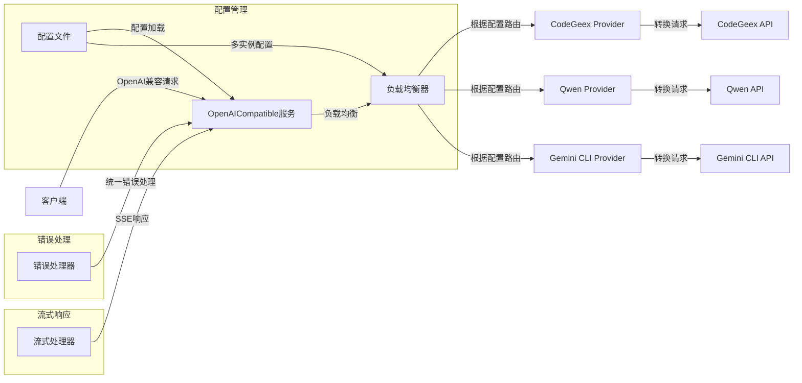

# OpenAICompatible

一个提供多种大语言模型服务提供商接口的中间件，支持动态切换服务提供商，提供OpenAI兼容的API接口。

## 特性

- 🔄 支持多种服务提供商（CodeGeex、Qwen、Gemini CLI等）
- 🎯 提供完全OpenAI兼容的API接口
- 🔌 易于扩展新的服务提供商
- 🛠️ 支持跨平台（Windows、Linux、MacOS）
- 🚀 简单易用的配置
- 📊 支持多实例配置和负载均衡
- 🌊 支持流式响应（SSE）
- 🛡️ 完善的错误处理机制
- 🔧 支持多种认证方式

## 架构



## 安装

### 预编译二进制

从[releases](https://github.com/WenChunTech/OpenAICompatible/releases)页面下载适合你系统的预编译二进制文件。

### 使用Docker

```bash
docker pull ghcr.io/wenchuntech/openaicompatible:latest
docker run -d -v config.json:/app/config.json -p 8080:8080 openaicompatible:latest
```

### 从源码构建

需求：
- Go 1.24.2 或更高版本

```bash
# 克隆仓库
git clone https://github.com/WenChunTech/OpenAICompatible.git
cd OpenAICompatible

# 构建
./build.sh
```

## 配置

创建`config.json`配置文件：

```json
{
    "host": "0.0.0.0",
    "port": 8080,
    "codegeex": [
        {
            "token": "你的CodeGeex token 1",
            "prefix": "codegeex1",
            "user_id": "user_id_1",
            "user_role": 1,
            "ide": "vscode",
            "ide_version": "1.0.0",
            "plugin_version": "1.0.0",
            "machine_id": "machine_1",
            "talk_id": "talk_1",
            "locale": "zh-CN"
        },
        {
            "token": "你的CodeGeex token 2",
            "prefix": "codegeex2"
        }
    ],
    "qwen": [
        {
            "token": "你的Qwen token 1",
            "prefix": "qwen1"
        },
        {
            "token": "你的Qwen token 2",
            "prefix": "qwen2"
        }
    ],
    "gemini_cli": [
        {
            "project_id": "你的Gemini项目ID",
            "token": {
              // 你的Gemini访问令牌
              },
            "prefix": "gemini1"
        }
    ]
}
```

### 配置项说明

- `host`: 服务监听地址
- `port`: 服务监听端口
- `codegeex`: CodeGeex服务配置数组
  - `token`: 访问令牌
  - `prefix`: 前缀标识（可选）
  - `user_id`: 用户ID（可选）
  - `user_role`: 用户角色（可选）
  - `ide`: IDE标识（可选）
  - `ide_version`: IDE版本（可选）
  - `plugin_version`: 插件版本（可选）
  - `machine_id`: 机器ID（可选）
  - `talk_id`: 会话ID（可选）
  - `locale`: 语言环境（可选）
- `qwen`: Qwen服务配置数组
  - `token`: 访问令牌
  - `prefix`: 前缀标识（可选）
- `gemini_cli`: Gemini CLI服务配置数组
  - `project_id`: Google Cloud项目ID
  - `token`: OAuth2访问令牌
  - `prefix`: 前缀标识（可选）

### 多实例配置

系统支持每个服务提供商配置多个实例，会自动进行负载均衡。请求时会按顺序轮询使用不同的实例。

### 认证方式

- CodeGeex: 使用API Token
- Qwen: 使用API Token
- Gemini CLI: 使用OAuth2 Token

## 支持的模型

系统会自动从各个服务提供商获取支持的模型列表，并为每个模型添加前缀以区分来源。例如：

- `codegeex/codegeex4`: CodeGeex 4模型
- `qwen/qwen-turbo`: Qwen Turbo模型
- `gemini_cli/gemini-pro`: Gemini Pro模型

完整的模型列表可以通过`/v1/models` API获取。

## API使用示例

### 聊天补全API

```bash
curl -X POST http://localhost:8080/v1/chat/completions \
  -H "Content-Type: application/json" \
  -d '{
    "model": "gpt-3.5-turbo",
    "messages": [
      {
        "role": "user",
        "content": "你好"
      }
    ]
  }'
```

### 获取模型列表API

```bash
curl http://localhost:8080/v1/models
```

## 扩展新的服务提供商

1. 在`src/provider`目录下创建新的服务提供商包
2. 实现`Provider`接口：
```go
type Provider interface {
    HandleChatCompleteRequest(ctx context.Context, r *model.OpenAIChatCompletionRequest) (*request.Response, error)
    HandleChatCompleteResponse(ctx context.Context, w http.ResponseWriter, r *request.Response) error
    HandleListModelRequest(ctx context.Context) (*request.Response, error)
    HandleListModelResponse(ctx context.Context, w http.ResponseWriter, r *request.Response) (*model.OpenAIModelListResponse,error)
}
```
3. 在`config.json`中添加相应的配置项
4. 在`main.go`中注册新的服务提供商

### 错误处理

系统提供了统一的错误处理机制，包括：

- 请求验证错误
- 服务提供商连接错误

### 流式响应

系统支持通过Server-Sent Events (SSE)实现流式响应：

1. 在请求中设置`"stream": true`
2. 系统会自动处理SSE格式的响应
3. 支持错误流的处理

流式响应使用示例：
```bash
curl -X POST http://localhost:8080/v1/chat/completions \
  -H "Content-Type: application/json" \
  -d '{
    "model": "codegeex/codegeex4",
    "messages": [
      {
        "role": "user",
        "content": "你好"
      }
    ],
    "stream": true
  }'
```

## 贡献指南

如果您想为OpenAICompatible项目做出贡献，请遵循[COMMIT_RULE.md](COMMIT_RULE.md)文件中的提交规则。


## 许可证

本项目采用 MIT 许可证 - 详见 [LICENSE](LICENSE) 文件